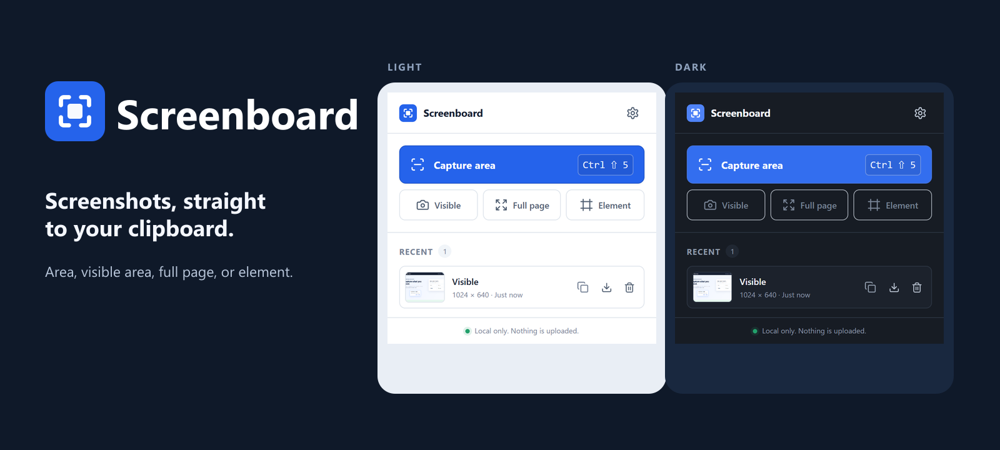
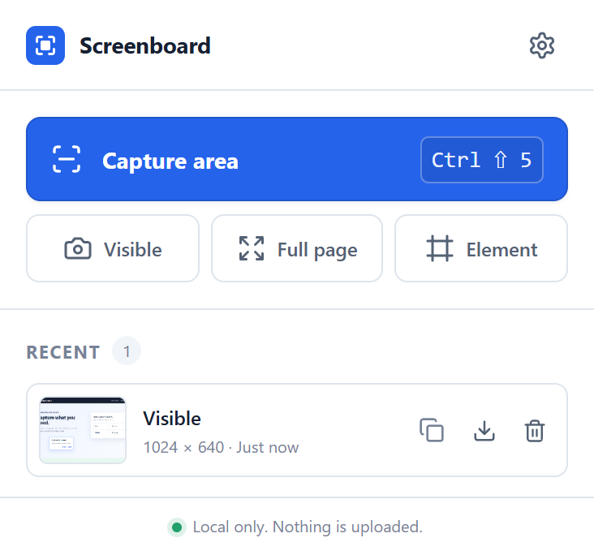

Screenboard is a local-first Chrome extension for capturing an area, the visible viewport, a full page, or a DOM element. A successful capture is already a PNG on the clipboard, ready to paste. There is no account, server, upload step, editor, or analytics dependency.



## Features

- Clipboard-first area capture with drag-in-any-direction selection and live dimensions
- One-click visible-area capture
- Full-page scroll and stitch with partial-slice handling and scroll restoration
- Element picker with parent/child keyboard traversal and Enter to capture
- Unconditional PNG clipboard writes with clear completion confirmation and optional automatic downloads
- Scrollable local capture history with full-resolution preview, copy, save, and delete actions
- Compact settings, light/dark themes, keyboard focus states, and reduced-motion support
- Friendly handling for protected pages, lost tabs, clipboard failures, and oversized pages

## Install for development

Requirements: Node.js 24 and pnpm 11.16.0 for development; Chrome 116+ to run the extension. CI pins Node.js 24.19.0 and Chrome for Testing 146.0.7680.153.

For the packaged release, download the extension ZIP from the [latest release](https://github.com/anaremore/screenboard/releases/latest), extract it, then load the extracted folder from `chrome://extensions` with **Developer mode** enabled.

To build from source:

```bash
npm install --global pnpm@11.16.0
pnpm install --frozen-lockfile
pnpm build
```

Then open `chrome://extensions`, enable **Developer mode**, choose **Load unpacked**, and select the generated `dist` directory.

For continuous development builds:

```bash
pnpm dev
```

Reload Screenboard from `chrome://extensions` after a rebuild.

## Commands

```bash
pnpm build              # production extension in dist/
pnpm typecheck          # strict TypeScript
pnpm lint               # ESLint
pnpm test               # unit tests
pnpm test:e2e           # browser integration and capture regressions
pnpm test:permissions   # Linux/X11 production-manifest activeTab smoke
pnpm check              # typecheck, lint, unit tests, icons, and production build
pnpm package:release    # package the verified dist/ build, plus a SHA-256 checksum
```

Use the committed pnpm lockfile and `--frozen-lockfile` for development and release installs. The E2E suite uses Puppeteer and an installed Chrome-for-Testing build. Set `CHROME_PATH` if it is not in Puppeteer's normal cache. Set `SCREENBOARD_HEADFUL=1` when clipboard integration or UI screenshots need a visible browser.

The main E2E suite generates a test-only extension copy with `<all_urls>` and `tabs` so a directly opened popup tab can drive capture workflows. The separate permission smoke loads the **unchanged production manifest**, verifies that page injection is denied, sends the actual Chrome keyboard shortcut through `xdotool`, verifies capture and clipboard success, and verifies the temporary grant is revoked on cross-origin navigation. This requires Linux, X11, `xdotool`, and `CHROME_PATH`; it does not grant permissions through CDP or modify the extension. [Chrome documents the keyboard gesture and temporary grant](https://developer.chrome.com/docs/extensions/develop/concepts/activeTab#invoking-activetab).

```bash
# Linux, after installing xvfb and xdotool and setting CHROME_PATH:
xvfb-run -a env SCREENBOARD_HEADFUL=1 pnpm test:e2e
xvfb-run -a pnpm test:permissions
```

## Repeatable release build

Install with the frozen lockfile, run `pnpm check` and both browser suites, then run `pnpm package:release`. Packaging requires matching versions in `package.json` and `public/manifest.json` and rejects test-only permission grants. It creates `release/screenboard-<version>.zip` and its SHA-256 checksum. The archive uses sorted paths and fixed timestamps, so the same build produces identical archive bytes on the pinned Node version. The ZIP contains the contents of `dist/` directly, ready to extract and load as an unpacked extension.

The GitHub Actions workflow performs these checks using a frozen pnpm install and pinned Node/Chrome versions, and uploads browser results and the verified release archive. Download the `screenboard-release` artifact after a successful run; publishing a GitHub or Chrome Web Store release remains a separate step.

## Keyboard shortcuts

| Action | Windows/Linux | macOS |
| --- | --- | --- |
| Capture area | `Ctrl+Shift+5` | `Command+Shift+5` |
| Capture visible area | `Ctrl+Shift+6` | `Command+Shift+6` |

Full-page and element commands are included but unbound by default. Chrome can reject a default that conflicts with the OS or another extension. Review or change every shortcut at `chrome://extensions/shortcuts`.

## Architecture

- **MV3 service worker** — coordinates Chrome APIs, capture jobs, error recovery, downloads, and session diagnostics.
- **On-demand content scripts** — render isolated Shadow DOM selectors, measure page geometry, coordinate scrolling, remove all Screenboard UI before capture, and perform the final focused-page clipboard handoff.
- **Offscreen document** — decodes screenshots, crops and stitches canvases, creates PNG blobs and thumbnails, and stores recent captures in IndexedDB.
- **Shared core** — pure geometry, scaling, slice planning, filename, settings, and history-policy modules covered by unit tests.
- **React surfaces** — the small popup and options page share a token-based light/dark design system and lightweight components.

Capture jobs are recorded in `chrome.storage.session`; navigation cancels abandoned selectors, and capture calls share a rate limiter. PNGs remain available in memory during delivery, and durable history stores blobs in IndexedDB after delivery. Downloads count as saved only after Chrome confirms completion. Crop scale comes from actual screenshot dimensions divided by measured CSS viewport dimensions, not from an assumed device pixel ratio.

## Privacy

Screenshot pixels, thumbnails, URLs, and capture metadata are never sent to an external service. Screenboard has no network client, account, telemetry, or remote processing. With history enabled, captures remain locally until deleted or removed by count/size cleanup. Turning history off removes new captures after successful delivery and preserves existing history. Failed delivery keeps a recovery copy. If durable storage fails or an image exceeds the history size limit, Recent labels the fallback as session-only; copy or save it before the extension restarts or newer temporary captures replace it.

The production extension requests only `activeTab`, `scripting`, `storage`, `offscreen`, `clipboardWrite`, and `downloads`. It does not request permanent access to every website.

See the full [privacy policy](PRIVACY.md) and the ready-to-paste [Chrome Web Store listing guide](docs/chrome-web-store-listing.md).

## Known limitations

- Chrome blocks script injection on `chrome://` pages, the Chrome Web Store, and some other protected surfaces. A visible screenshot may still be retained locally, but automatic clipboard handoff and page-based selection cannot run there.
- Chrome and the operating system impose maximum canvas and clipboard sizes. Screenboard rejects unsafe full-page dimensions and keeps a recoverable recent capture when clipboard writing fails.
- Very dynamic, infinitely scrolling, animated, or virtualized pages can change while a multi-slice capture is in progress. Animations are paused; sticky elements remain in their normal document flow, and fixed elements are hidden after the first slice to reduce seams.
- Full-page capture represents the document's scrollable content width; browser scrollbar chrome is intentionally excluded.
